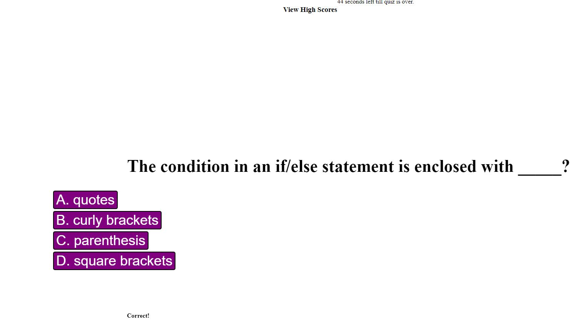

# Coding-Quiz-Challenge
## Module4-Challenge
## Homework Assignment 4 - Coding Quiz 12/19/2022

### Motivation
This was the fourth assignment for our coding bootcamp. The assignment was to create a quiz challenge for self review or for other coders to use as a study aide/review. As usual we had to follow thhe user story provided and make sure all functionalities worked as intended and described in the acceptance criteria. All while following the rules of HTML, CSS, JavaScript logic and syntax.

### Build Status
Running as a GitHub Webpage

### Features
A basic webpage with drop down selectors that generates a new password with varying requirements.

### Installation
N/A

### Project Preview

### How to Use
The webpage can be found on the following this link [here.](https://aguilarj5.github.io/Coding-Quiz-Challenge/)

### Credits
Coding Bootcamp

### License
N/A

